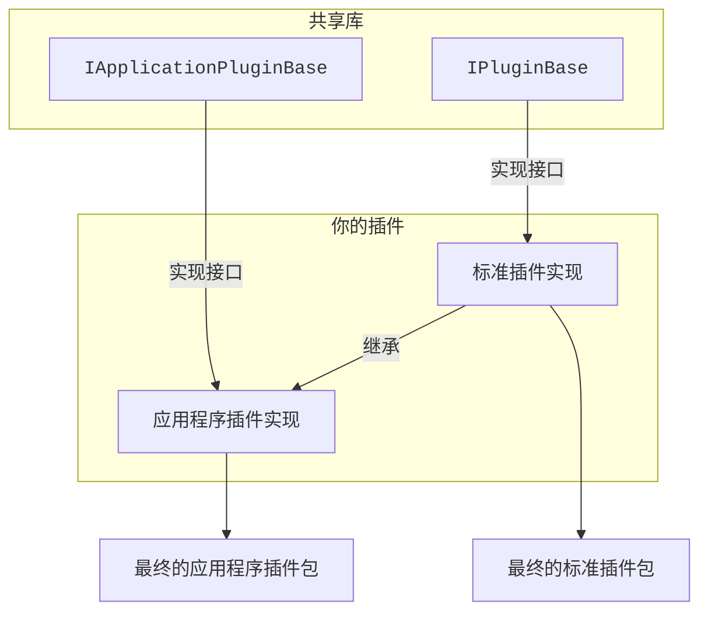

# projectFrameCut 插件模板
> [!IMPORTANT]
> 从API V3（1.4.0.0）开始，打包器被拆分到了一个单独的存储库。
> 因此，这里的模板项目已经不再包含打包器的相关内容了，如果你需要使用打包器，请前往[这个仓库](https://github.com/hexadecimal0x12e/projectFrameCut.PluginPackager.MSBuild)
> 打包器的包ID不变，仍然是 `projectFrameCut.PluginPackager.MSBuild`。

# 如何开发
你即可以从这里的模板开始，也可以手动一步步来，从头开始。
**详见[这里](HowToMakePlugin.md)**。

# 关于普通插件和应用程序插件的区别
projectFrameCut 的插件实现分两种：标准插件 (.NET 类库) 和应用程序插件 (.NET **MAUI** 类库)
其中**应用程序插件**可以实现更多的功能，包括效果组和可交互的设置页面等等。

由于两种实现依赖的类库类型不同，因此，只有应用程序可以加载**应用程序插件**，而独立渲染器、或者未来可能有的云端/远程渲染只会支持**标准插件**。

实际上，应用程序插件的基类 `IApplicationPluginBase` 是由标准插件 `IPluginBase` 继承而来的，因此，他们的区别实际上没那么大，开发的过程也几乎一致。

一个建议的开发方法是，先使用**标准插件**(`IPluginBase`)实现所有的基础API，再实现一个**应用程序插件**(`IApplicationPluginBase`)并且继承你实现的**标准插件**，然后实现新的、应用程序插件专属的功能，通过配置`<PluginIDOverride>`和`<GeneratePluginInfoSource>`覆盖生成的插件ID使其和主插件一致，打包并且方法两个方法实现的插件提供给用户。

看不懂？看流程图：

你可以参照这个仓库里的两个模板项目，`projectFrameCut.PluginTemplate` 和 `projectFrameCut.ApplicationPluginTemplate` 来了解如何实现这两种插件。

