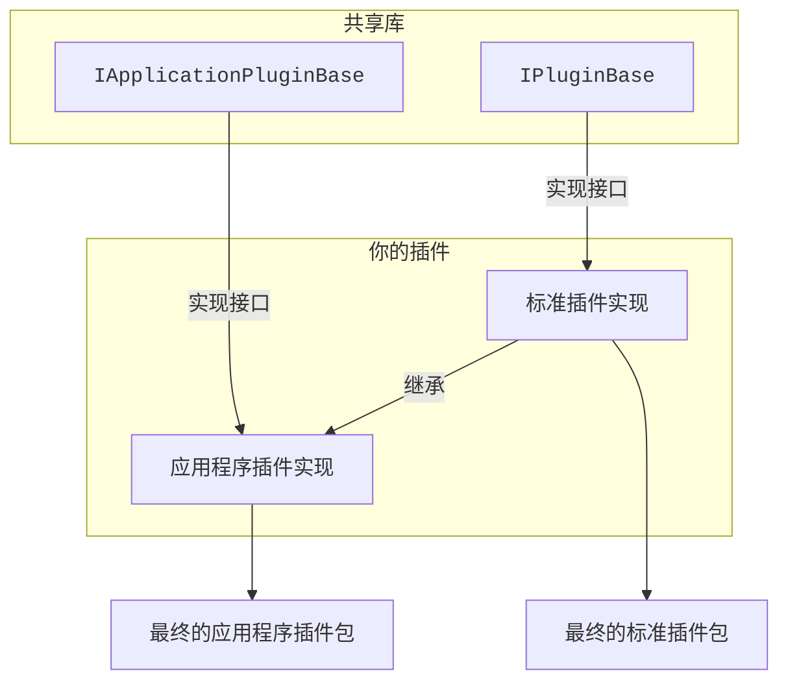

# projectFrameCut 插件模板
这个仓库提供了能够让你为[projectFrameCut](https://github.com/hexadecimal0x12e/projectFrameCut)应用程序、独立渲染器、相关组件、及 projectFrameCut 的衍生版本（如果他们的开发者愿意的话）开发一个插件，自定义projectFrameCut的功能的能力。

# 如何开发
你即可以从这里的模板开始，也可以手动一步步来，从头开始。
**详见[这里](HowToMakePlugin.md)**。

# 关于普通插件和应用程序插件的区别
projectFrameCut 的插件实现分两种：标准插件 (.NET 类库) 和应用程序插件 (.NET **MAUI** 类库)
其中**应用程序插件**可以实现更多的功能，包括效果组和可交互的设置页面等等。

由于两种实现依赖的类库类型不同，因此，只有应用程序可以加载**应用程序插件**，而独立渲染器、或者未来可能有的云端/远程渲染只会支持**标准插件**。

实际上，应用程序插件的基类 `IApplicationPluginBase` 是由标准插件 `IPluginBase` 继承而来的，因此，他们的区别实际上没那么大，开发的过程也几乎一致。

一个建议的开发方法是，先使用**标准插件**(`IPluginBase`)实现所有的基础API，再实现一个**应用程序插件**(`IApplicationPluginBase`)并且继承你实现的**标准插件**，然后实现新的、应用程序插件专属的功能，通过配置`<PluginIDOverride>`和`<GeneratePluginInfoSource>`覆盖生成的插件ID使其和主插件一致，打包并且方法两个方法实现的插件提供给用户。

看不懂？看流程图：

你可以参照这个仓库里的两个模板项目，`projectFrameCut.PluginTemplate` 和 `projectFrameCut.ApplicationPluginTemplate` 来了解如何实现这两种插件。

# 打包器配置
打包器向MSBuild提供了一些参数来控制打包器的行为：
### 基础信息
这些配置不是由打包器特有的，而是标准的NuGet包属性：
* `PackageId`： 插件的包ID，也会作为它的唯一标识符，
    **请确保他和你的插件类的全名一致，并且不得以`projectFrameCut`开头（不区分大小写）**。 
    如果同时配置了`PluginIDOverride`和`PackageId`，打包器会使用`PluginIDOverride`的值作为插件ID。
* `Version`： 插件的版本号
* `PackageProjectUrl`： 插件的项目主页URL，可以留空

下面这些属性都是没有本地化的，如果你想要本地化这些信息，请配置插件基类的`LocalizationProvider`。
* `Title`： 插件的显示名称
* `Authors`： 插件的作者
* `Description`： 插件的描述

### 签名
* `PluginSignFilePath`：必须设置这个属性来配置签名密钥
    最方便的方式是使用`PluginKeyGenerator.cs`来生成一个签名文件。
    如果你想要手动构建签名文件，你需要先准备一个Base64格式的PKCS #8密钥对，然后创建一个JSON文件，填入公钥到签名文件的`Key`字段，填入私钥到`Value`字段。

### 素材
* `PluginAssetPath`：插件素材的路径，打包器会把这个路径下的所有文件都包含进插件包里。如果不需要素材，可以不设置这个属性。

### 源生成
* `GeneratePluginInfoSource`：是否生成插件信息源代码文件，默认为 `true`。如果你通过继承标准插件来实现应用程序插件，或者就是想手动实现插件信息，设置为 `false` 可以阻止源生成。
* `GeneratePluginInfoSourcePath`：生成的插件信息源代码文件的路径，
    默认为空，表示生成在 `obj\GeneratedSource\PluginInfo.g.cs`。如果你想指定路径，可以设置为你想要的路径。
* `PluginIDOverride`：用于覆盖生成的插件ID，而不是使用NuGet属性`PackageId`。如果你通过继承标准插件来实现应用程序插件，你需要设置这个参数来确保他们的插件ID一致。

# 打包插件
使用`dotnet publish`命令来打包你的插件，编译完成之后，在输出目录下会生成一个`.pfcplugin`的插件包文件。

你必须使用 .NET CLI来打包，**不要使用Visual Studio的打包功能**。如果你已经在使用命令行但是持续遇到报错`To bundle a plugin, please use 'dotnet publish' command, instead of using Visual Studio's Publish tool...`，请添加命令行参数`-p:BundlePlugin=true` 到`dotnet publish`命令里。

